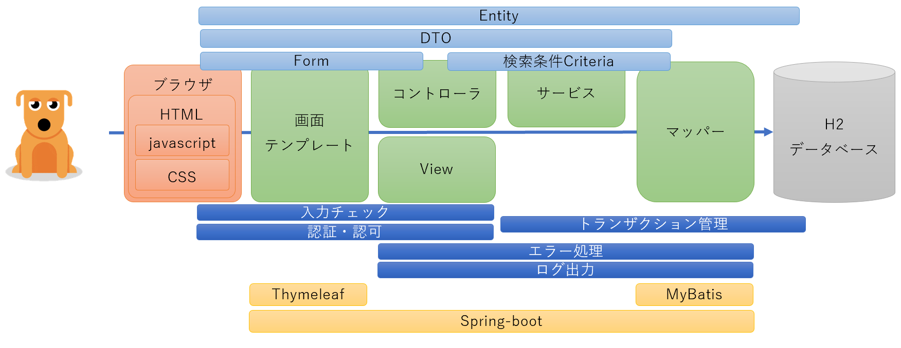

## 追加機能
* 照会画面作成(BA03)
* 変更削除画面作成(BA05)
* CSS実装(Tailwind CSS)  現在作成中
  
## Tailwind CSSとは
  - CSSフレームワークの一つです。他のCSSフレームワークではBootstrap、BulmaやMaterial UIなどがある。
  - Tailwind CSSの特徴・メリットは"Bootstrap などのフレームワークではコンポーネントが事前に準備されていることでサイトデザインを効率的に行うことができる反面、同じデザインを使うためオリジナルティがないという欠点があると言われています。それに比べて Tailwind CSS ではコンポーネントが準備されていないため、同じボタンというコンポーネントを作成するにも各自が異なる utility class を適用して作成していくことになるため結果としてオリジナリティの高いサイトを作成することができます。"と以下のサイトで書かれていました。  
    https://reffect.co.jp/html/tailwindcss-for-beginners/
## VSCodeデバックモード実行方法
以下を押下


ーーーーーーーーーーーーーーーーーーーーーーーーーーーーーーーーーーーーーーーーー
# spring-boot2-train

Spring-Bootで、がっちり業務アプリケーション開発

## やりたいこと

* マスタ管理を行うWEBの業務アプリケーションをがっちりと作る
* クラスやパッケージ等の命名にはIDを使用する
* アプリケーション共通機能（認証、認可、エラー処理、ログ出力、コード管理）も作る
* 画面はThymeleafのHTMLテンプレートを使用することで、Tomcat起動を行わなくても、直接HTMLファイルを開けば画面モックとしてレイアウト確認ができる
* テーブルは1テーブル
* 登録機能と検索機能を実装する
* 照会機能と削除機能は未実装のため、あとで実装にチャレンジするべし
* javascriptとCSSは未実装のため、あとで実装にチャレンジするべし

### 登録機能について
以下の機能を実装する
* 画面遷移
  - 登録画面⇒登録ボタン⇒確認画面⇒確認ボタン⇒HTTPリダイレクト⇒完了画面
  - 登録画面⇒登録ボタン⇒確認画面⇒戻るボタン⇒登録画面
* 入力チェック
  - 単項目チェック
  - 相関項目チェック
  - 業務チェック（DBとのチェックなど）
* 型変換、フォーマット変換
* テーブルに1件インサート処理
* プライマリーキーのシーケンス採番 `#未実装`
* 登録サービスクラスに対する単体テスト `#未実装`

### 検索機能について
以下の機能を実装する
* 画面遷移
  - 検索画面⇒検索ボタン⇒検索画面
  - 検索画面⇒ページリンク⇒検索画面
* 初期表示時の検索結果表示
* 1ページ5件でのページング（オフセット、リミットによるページ制御）
* 最大ヒット総件数1000件未満のチェック
* 0件ヒット時のエラーメッセージ表示
* 複数テーブルからのSELECT処理 `#未実装`
* 検索サービスクラスに対する単体テスト

## アプリケーション構成



* 画面層（画面テンプレート、HTML、javascript、CSS）
  - ユーザインタフェース
  - ユーザ操作によりイベント発生
  - アプリケーションからの結果返却、メッセージ通知
  - javascript `#未実装`
  - CSS `#未実装`
* コントローラ層（コントローラクラス、フォームクラス、ヘルパークラス）
  - 画面遷移
  - 入力チェック
  - メッセージ出力
  - フォームクラスから、登録用エンティティオブジェクト生成
  - フォームクラスから、検索条件オブジェクト生成
* サービス層（サービスクラス、DTO）
  - 業務処理
  - 業務例外
  - トランザクション管理
  - DTO `#未実装`
* データ層（ORマッパー、XMLファイル）
  - SQL発行
  - JAVAオブジェクトとデータのマッピング、型変換、フォーマット変換
  - 登録者、登録日時、更新者、更新日時の自動付与 `#未実装`

## 前提環境

以下がインストール済みであること
* JDK 11
* git
* 統合開発環境（vscode or eclipse）

## 前提

できれば、以下を動かしていること
※mysqlデータベースが必須構成になっているため、インストールが必要
https://github.com/namickey/spring-boot2-try

## 使用するフレームワーク

* spring-boot2.7
* spring-boot-starter-web
* spring-boot-devtools
* spring-boot-starter-actuator
* spring-boot-starter-security
* spring-boot-starter-validation
* thymeleaf
* mybatis
* spring-data-commons
* logback-access
* lombok
* 組み込みH2データベース
* 組み込みTomcat 9
* 組み込みMaven 3

## ディレクトリ階層
```
C:.
│  .gitignore
│  mvnw
│  mvnw.cmd
│  pom.xml
│  README.md
│  run.bat
├─.mvn
│  └─wrapper
│          maven-wrapper.jar
│          maven-wrapper.properties
├─log
│      .gitkeep
├─src
│  ├─main
│  │  ├─java
│  │  │  └─com
│  │  │      └─example
│  │  │          └─demo
│  │  │              │  DemoApplication.java
│  │  │              ├─common
│  │  │              │  └─code  コード管理
│  │  │              │          ItemGroup.java
│  │  │              ├─core
│  │  │              │  ├─exception
│  │  │              │  │      AppException.java
│  │  │              │  │      SystemException.java
│  │  │              │  ├─handler  例外ハンドラー
│  │  │              │  │      WebExceptionHandler.java
│  │  │              │  ├─log
│  │  │              │  │      AccessLogCustomizer.java
│  │  │              │  │      SessionidAccessConverter.java
│  │  │              │  │      SessionidFilter.java
│  │  │              │  │      UseridAccessConverter.java
│  │  │              │  │      UseridFilter.java
│  │  │              │  └─security  認証、認可
│  │  │              │          DbUserDetailsService.java
│  │  │              │          MockUserDetailsService.java
│  │  │              │          WebSecurityConfig.java
│  │  │              ├─entity
│  │  │              │      Item.java
│  │  │              └─web
│  │  │                  ├─aa01    TOP画面
│  │  │                  │      AA0101Controller.java
│  │  │                  ├─ba01    登録機能
│  │  │                  │      BA0101Controller.java
│  │  │                  │      ItemForm.java
│  │  │                  │      ItemRegistService.java
│  │  │                  │      ItemRegistViewHelper.java
│  │  │                  ├─ba02    検索機能
│  │  │                  │      BA0201Controller.java
│  │  │                  │      ItemSearchCriteria.java
│  │  │                  │      ItemSearchForm.java
│  │  │                  │      ItemSearchService.java
│  │  │                  ├─ba03    照会機能
│  │  │                  │      BA0301Controller.java
│  │  │                  ├─ba04    削除機能
│  │  │                  │      BA0401Controller.java
│  │  │                  └─mapper
│  │  │                          ItemMapper.java
│  │  └─resources
│  │      │  application.properties
│  │      │  data-all.sql
│  │      │  logback-spring.xml    業務アプリケーションログ、その他ログ設定
│  │      │  messages.properties    メッセージ管理
│  │      │  schema-all.sql
│  │      ├─com
│  │      │  └─example
│  │      │      └─demo
│  │      │          └─web
│  │      │              └─mapper
│  │      │                      ItemMapper.xml
│  │      ├─conf
│  │      │      logback-access.xml  アクセスログ設定
│  │      └─templates
│  │          │  error.html         システムエラー画面
│  │          ├─AA0101
│  │          │      index.html     TOP画面
│  │          ├─BA0101
│  │          │      complete.html  完了画面
│  │          │      confirm.html   確認画面 
│  │          │      regist.html    登録画面
│  │          ├─BA0201
│  │          │      search.html    検索画面
│  │          ├─BA0301
│  │          │      index.html     照会画面
│  │          ├─BA0401
│  │          │      delete.html    削除画面
│  │          └─error
│  │                  403.html      認証認可エラー画面
│  │                  404.html
│  └─test
│      └─java
│          └─com
│              └─example
│                  └─demo
│                      │  DemoApplicationTests.java
│                      └─web
│                          └─ba02
│                                  ItemSearchServiceTest.java

```

## 準備 githubからソースコードを取得

gitを使ってソースコードをダウンロードする
```
コマンドプロンプトで実行
git clone https://github.com/namickey/spring-boot2-train.git
cd spring-boot2-train
```

## 実行 spring-boot:run

起動する
```
コマンドプロンプトで実行
mvnw.cmd spring-boot:run

「mvn」や「mvnw.cmd」はmavenのコマンドで、pom.xmlに記載されたライブラリ管理（自動的にクラスパス追加）
初回はライブラリのダウンロードに多少時間がかかった後に、起動する
```

## ログインユーザと認可権限について

開発向けログイン実装として、ユーザIDと同じパスワードを入力することで、ログインできるようにしている。  
例（ユーザID/パスワード）：hoge/hoge、foo/foo、etc/etc  

また削除画面については、root/rootでログインすることで、システム権限ロールが付与されて削除画面が表示されるように認可機能によるアクセス制限を行っている。  

| 画面 | ロール |
----|----
| 登録画面 | 一般（user）の利用可 |
| 検索画面 | 一般（user）の利用可 |
| 詳細画面 | 一般（user）の利用可 |
| 削除画面 | システム権限（system）のみ利用可 ※root/rootでログイン |

## ブラウザアクセス
http://localhost:8080/

* ログイン画面からログインする
* 登録画面でitemを登録する
* 検索画面でitemを検索する

## H2データベースのコンソール

以下のURLにブラウザからアクセスし、データベースのテーブルを確認する  
http://localhost:8080/h2-console  
```
表示されたH2データベースの接続画面にて、以下の情報を記載して接続する
JDBC URL=jdbc:h2:mem:testdb
User Name=sa
Password=
```

## 停止
```
コマンドプロンプトで実行
Ctrl + C
```

## やってみよう 

* 実装と挙動を確認しよう
* 全てを写経しよう
* 未実装機能をつくってみよう

## アプリケーション共通機能について

今回のアプリケーションが備える共通機能（認証認可、エラー処理、ログ出力、コード管理）について概要を示す  
未実装の機能については、`#未実装`と記載

### 認証・認可機能

* 認証機能
  - Spring-Securtyを使って実現する
  - IDとパスワードを用いた認証を行う
  - 認証済みアクセス以外は、認証エラー画面を表示する  
    以下、未実装
  - 初回ログイン時のパスワード変更 `#未実装`
  - 三か月毎のパスワード変更 `#未実装`
  - 過去に使用したパスワード使用不可 `#未実装`
  - パスワードに使用するべき文字種類の必須指定 `#未実装`
  - システム管理者によるパスワードリセット `#未実装`
  - 本人宛メールによるパスワードリセット `#未実装`
  - 指定回数のパスワード誤りによる指定時間のロック `#未実装`
  - 指定時間経過後、またはシステム管理者によるロック解除 `#未実装`
* 環境毎での認証コンポーネント切り替える
  - アプリケーションプロパティファイルを使い切り替えを行う
  - 本番環境用の認証コンポーネントではデータベースでのユーザIDとパスワードを管理する `#未実装`  
    パスワードはハッシュ化してデータベースに保管する  
    パスワードのハッシュ化には`PBKDF2`という強度が高いハッシュ化モジュールを使用する
  - 開発環境用の認証コンポーネントでは、特にユーザ管理は行わず、ユーザIDと同じパスワードで認証を行う
* 認可機能
  - Spring-Securtyを使って実現する
  - ユーザ毎に強い権限、弱い権限を持たせ、それらをロールとして定義し、ユーザ毎に管理を行う
  - ロール毎にアクセス可能な画面URLを定義を行い、強い権限を持つシステム管理者ロールを持つユーザだけがアクセスできるシステム管理画面を作成するなどの認可の画面制御を行う
  - 弱い権限しか持たない一般ロールを持つユーザには、システム管理画面への画面リンクを表示しない制御を行う
  - 認可されていないユーザが直接URLを開くなど、不正にアクセスした場合には、認可エラー画面を表示する
  - ユーザとロールの紐づけをデータベースで管理 `#未実装`
  - 組織単位、部署単位の認可制御 `#未実装`

### エラー処理

* エラー種類
  - 入力チェックエラー  
    ⇒ユーザに改善と再実行を促すメッセージを画面表示する
  - 業務エラー  
    ⇒ユーザに改善と再実行を促すメッセージを画面表示する  
    ⇒トランザクションはロールバックする
  - システムエラー  
    ⇒予期せぬエラーで業務処理の継続不可、システム管理者へ通知する  
    ⇒システムエラー画面に遷移する  
    ⇒トランザクションはロールバックする
  - 認証・認可エラー  
    ⇒不正アクセス防止のため、処理の継続不可  
    ⇒認証・認可エラー画面に遷移する
* 例外クラス、例外ハンドラー
  - 業務アプリケーション例外クラス  
    ⇒業務機能ごとのサービスクラスやコントローラクラスで例外スローや例外ハンドリングを行う
    ⇒ハンドリング内容としては、前の画面への遷移や、画面へのメッセージ表示を行う
  - システム例外クラス  
    ⇒システムで共通した例外ハンドラーを作成し、例外ハンドリングを行う  
    ⇒ハンドリング内容としては、システムエラー画面への遷移や、システム管理者への通知、スタックトレースのログ出力
* メッセージ管理
  - メッセージプロパティファイルにて、メッセージIDとメッセージ内容の管理を行う

### ログ出力
* ログの種類
  - アクセスログ
  - 業務アプリケーションログ
  - パフォーマンスログ
  - エラー解析用ログ
  - エラー監視用ログ `#未実装`
  - 監査ログ `#未実装`
  - その他ログ
* ログ出力先
  - 標準出力
  - ファイル出力
  - DB出力 `#未実装`
* ログローテーション
  - 日付単位ローテーション
  - 指定サイズ単位ローテーション `#未実装`
* ログフォーマット
  - タイムスタンプ、IP、セッションID、ユーザID、HTTPステータス、経過時間、etc

### コード管理
* 例：結果コード（0=正常、1=異常）  
  例：ステータスコード（0=未処理、1=処理中、2=正常終了、3=異常終了）  
  例：拠点コード（01=東京、02=大阪）
* enumを使ったコード管理  
* 定数クラスを使ったコード管理 `#enum以外の実現方法`
* データベースを使ったコード管理 `#enum以外の実現方法`

### ヘルスチェック機能
* spring-boot-starter-actuatorを使って実現する
* 以下のURLにアクセスすることで、システムの正常性確認を行う  
  http://localhost:8080/actuator/health
* 認証を行わずに上記URLへのアクセスを可能とするため、認証対象から除外する

## 挑戦してみよう

* クラウドへデプロイ
* コンテナイメージとしてデプロイ
* クラウド環境の自動構築及びデプロイ自動化

## 次にjavascript + WEBAPIを学ぼう
未着手  

## 次にGitHubからAWSへの自動デプロイを学ぼう

https://github.com/namickey/spring-boot2-aws-terraform

## 参考サイト

【Spring Security】認証・認可の基礎  
https://b1san-blog.com/post/spring/spring-sec-auth/  

Spring Bootにおけるページング  
https://qiita.com/takaakitanaka_cre-co/items/1571bcd870bd64d83d15  

JUnit5を使おう  
https://www.m3tech.blog/entry/2018/12/20/junit5  

Spring Frameworkを利用する実プロジェクトで活用できる設計・開発標準  
https://fintan.jp/page/5311/  
